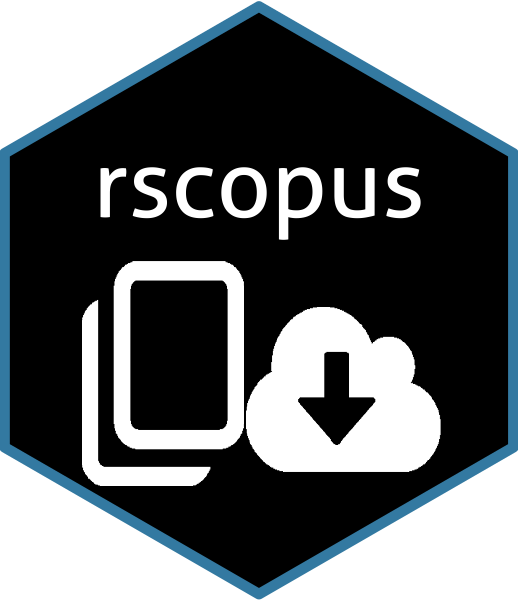

<!-- README.md is generated from README.Rmd. Please edit that file -->

R Package to interface with Elsevier and Scopus APIs

<!--  -->


[](https://travis-ci.org/muschellij2/rscopus)
[](https://ci.appveyor.com/project/muschellij2/rscopus)


```{r setup, include = FALSE}
knitr::opts_chunk$set(
  collapse = TRUE,
  comment = "#>",
  fig.path = "man/figures/README-"
)
```

# rscopus

The goal of rscopus is to provide an R Scopus Database 'API' Interface.

## Installation

You can install `rscopus` from github with:

```{r gh-installation, eval = FALSE}
# install.packages("devtools")
devtools::install_github("muschellij2/rscopus")
```

## Steps to get API key

In order to use this package, you need an API key from https://dev.elsevier.com/sc_apis.html.  You should login from your institution and go to Create API Key.  You need to provide a website URL and a label, but the website can be your personal website, and agree to the terms of service.  


1.  Go to https://dev.elsevier.com/user/login. Login or create a free account.
2.  Click "Create API Key".  Put in a label, such as `rscopus key`.  Add a website.  http://example.com is fine if you do not have a site.
3.  **Read** and agree to the TOS if you do indeed agree.
4.  Add `Elsevier_API = "API KEY GOES HERE"` to `~/.Renviron` file, or add `export Elsevier_API=API KEY GOES HERE` to your `~/.bash_profile`. 

Alternatively, you you can either set the API key using `rscopus::set_api_key` or by `options("elsevier_api_key" = api_key)`.  You can access the API key using `rscopus::get_api_key`. 

You should be able to test out the API key using the [interactive Scopus APIs](https://dev.elsevier.com/scopus.html).

### A note about API keys and IP addresses
The API Key is bound to a set of IP addresses, usually bound to your institution.  Therefore, if you are using this for a Shiny application, you must host the Shiny application from your institution servers in some way.  Also, you cannot access the Scopus API with this key if you are offsite and must VPN into the server or use a computing cluster with an institution IP.

See https://dev.elsevier.com/tecdoc_api_authentication.html


## Example

This is a basic example which shows you how to solve a common problem:

```{r example, eval = TRUE, message=FALSE}
library(rscopus)
library(dplyr)
res = author_df(last_name = "Muschelli", first_name = "John", verbose = FALSE, general = FALSE)
names(res)
head(res[, c("title", "journal", "description")])
unique(res$au_id)
unique(as.character(res$affilname_1))

all_dat = author_data(last_name = "Muschelli", 
                 first_name = "John", verbose = FALSE, general = TRUE)
res2 = all_dat$df
res2 = res2 %>% 
  rename(journal = `prism:publicationName`,
         title = `dc:title`,
         description = `dc:description`)
head(res[, c("title", "journal", "description")])
```

## Using an Institution Token

As per https://dev.elsevier.com/tecdoc_api_authentication.html: "Using a proprietary token (an "Institutional Token") created for you by our integration support team", so you need to contact Scopus to get one.  If you have one and it's located in an object called `token`, you should be able to use it as:

```{r, eval = FALSE}
# token is from Scopus dev
hdr = inst_token_header(token)
res = author_df(last_name = "Muschelli", first_name = "John", verbose = FALSE, general = FALSE, headers = hdr)
```

but I have not tried it extensively.
